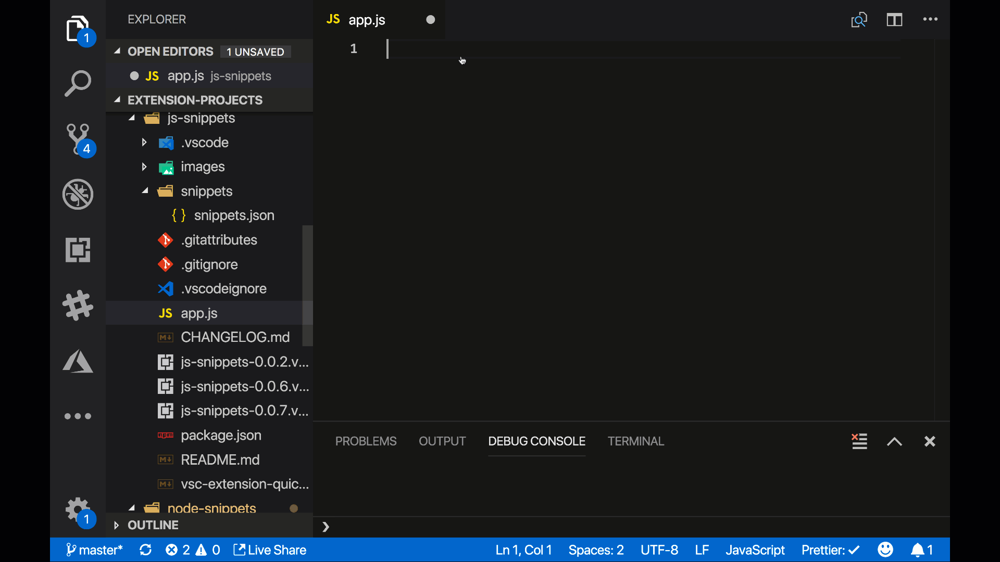

# js-snippets

This is an extension meant to give you some awesome JS snippets

## Features

A collection of JS snippets

The following commands are available:

- `js-log`, prints console.log()
- `js-log-err`, prints console.error()
- `js-log-warn`, prints console.warn()
- `js-elif`, prints if, else
- `js-eliff`, prints if, else-if, else
- `js-tcf`, prints try, catch, finally
- `js-scd`, prints switch, case, default
- `js-arr-filter`, creates an array and calls `filter()`
- `js-arr-reduce`, creates an array and calls `reduce()`
- `js-arr-contains`, creates an array and calls `some()`
- `js-arr-all`, creates an array and calls `every()`,
- `js-dest-array`, creates an array and applies destructuring on it
- `js-dest-object`, creates an object and applies destrucring on it
- `js-dest-param`, creates a function and passes a parameter that we apply
  destructuring to
- `js-promise-create`, creates a Promise by instantiating it
- `js-promise-shorthand`, uses the static resolve/reject, good for unit tests
- `js-promise-all`, uses the static all(), allows us to have a list of Promises finish at the same time
- `js-async-await`, demonstrates async/await

## Release Notes

This is the release notes.

### 1.0.0

Added video to showcase usage

### 0.0.6

added promises and async/await

### 0.0.6

Changed array commands so you find the under `js-arr-*`.

Added `destructuring` snippets, read more on it here [Destructuring(https://developer.mozillaorg/en-US/docs/Web/JavaScript/Reference/Operators/Destructuring_assignment)

### 0.0.5

adding repo and image, renaming all commands to `js-` something to make it easier to find them

### 0.0.4

minor corrections

### 0.0.3

- added try, catch, finally
- added switch, case, default
- added array methods `filter()`, `reduce()`, `some()` and `all`

### 0.0.2

added if, else, better docs

### 0.0.1

some log functions for now

## Publisher

Chris Noring
@chris_noring
